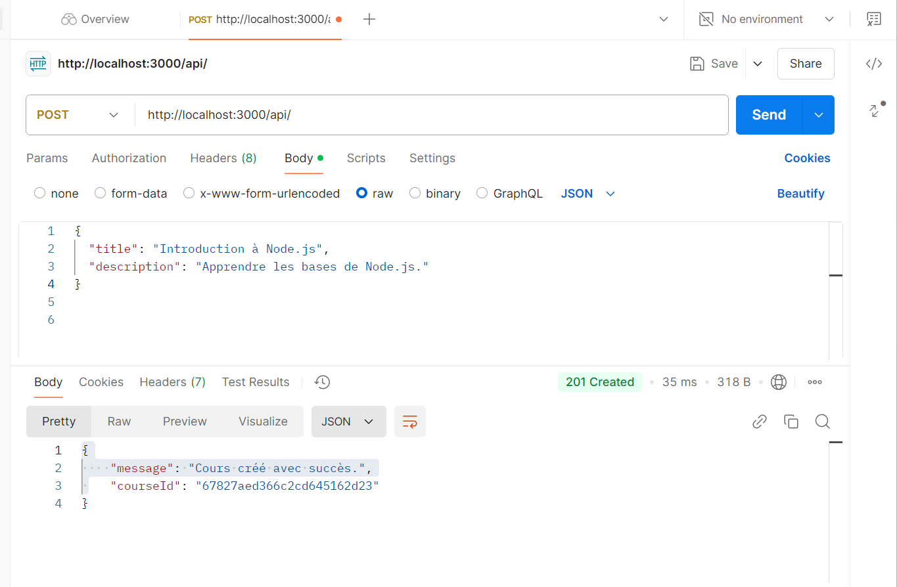
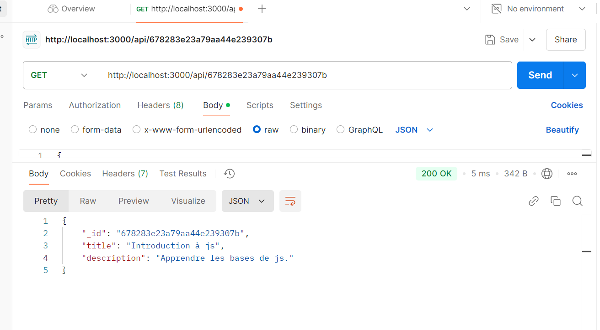
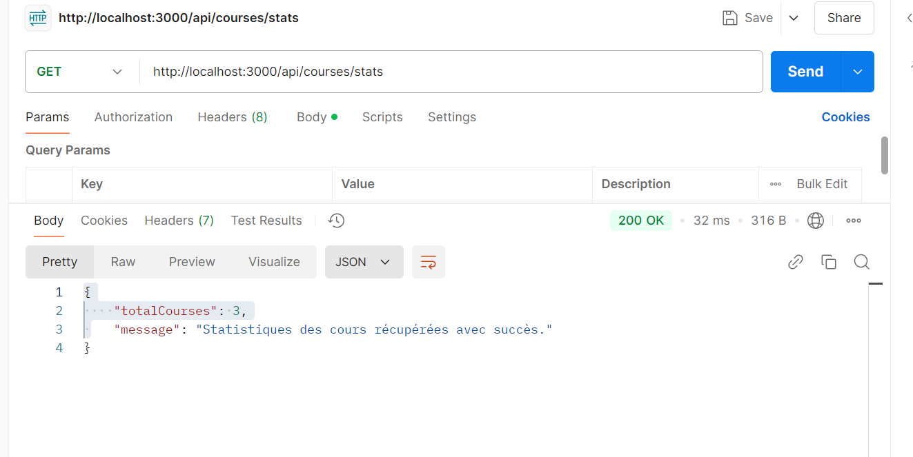

# Learning Platform Template
Ce projet est une plateforme d'apprentissage conçue pour gérer des cours, mettant en œuvre une architecture modulaire et utilisant des technologies modernes telles que **Node.js**, **MongoDB**, et **Redis**
## 📦 Structure du projet

src/ 
├── app.js                   # Point d'entrée principal 
├── config/                                              
│   ├── db.js                # Configuration des connexions à MongoDB et Redis  
│   ├── env.js               # Gestion des variables d'environnement       
├── controllers/             
│   ├── courseController.js  # Logique métier pour les cours  
├── routes/  
│   ├── courseRoutes.js      # Définition des routes pour les cours  
├── services/         
│   ├── mongoService.js      # Services pour interagir avec MongoDB  
│   ├── redisService.js      # Services pour interagir avec Redis  
├── models/                  # (À créer si besoin, pour gérer les modèles de données) 
 ## Installation
  `git clone https://github.com/Drissrad/learning-platform-nosql`  
  `cd learning-platform-template`                            
 ` npm install`                                               
  Démarrer MongoDB et Redis   
   `mongod`  
  `redis-server`  
 ##  Lancer le projet
 `npm start`  
Une fois démarré, le serveur est accessible sur le port spécifié (par défaut : 3000).  
Exemple d'API disponible   
POST /api/courses : Créer un cours  
GET /api/courses/:id : Obtenir un cours par son ID  
GET /api/courses/stats : Obtenir les statistiques des cours 
## Choix techniques
Node.js & Express : Utilisé pour sa simplicité et sa popularité dans la création d'API RESTful.  
MongoDB : Base de données NoSQL choisie pour sa flexibilité dans le stockage des documents JSON.- 
Redis : Implémenté pour le cache, améliorant les performances lors des requêtes répétitives. 
## Réponses aux questions 
1. Pourquoi créer un module séparé pour les connexions aux bases de données ? 
Réponse : 
Créer un module séparé permet de centraliser la logique de connexion pour MongoDB et Redis. Cela facilite la réutilisation, la maintenance, et garantit une séparation des préoccupations dans le code.  
2. Comment gérer proprement la fermeture des connexions ? 
Réponse : 
Les connexions doivent être fermées proprement pour éviter les fuites de ressources. Dans notre projet, nous utilisons des hooks système comme SIGTERM et SIGINT pour appeler des fonctions de fermeture spécifiques aux bases de données (closeConnections). 
3. Pourquoi est-il important de valider les variables d'environnement au démarrage ? 
Réponse : 
La validation garantit que toutes les configurations nécessaires (comme les URI des bases de données) sont disponibles. Cela évite les erreurs imprévues en production. 
4. Que se passe-t-il si une variable requise est manquante ? 
Réponse : 
Si une variable est manquante, le projet est incapable de fonctionner correctement (ex : absence de connexion aux bases de données). Dans notre projet, une erreur explicite est levée pour alerter immédiatement le développeur. 
5. Quelle est la différence entre un contrôleur et une route ? 
Réponse : 
Une route définit les points d'accès de l'API (endpoints). 
Un contrôleur contient la logique métier associée à ces endpoints. 
Cela permet de séparer les responsabilités et d'améliorer la maintenabilité. 
6. Pourquoi séparer la logique métier des routes ? 
Réponse : 
Pour éviter les duplications, rendre le code plus lisible et permettre des tests unitaires indépendants sur la logique métier. 
7. Pourquoi séparer les routes dans différents fichiers ? 
Réponse : 
Cela améliore l'organisation du projet en regroupant les routes par fonctionnalités. Par exemple, les routes pour les cours sont dans courseRoutes, et celles pour les étudiants dans studentRoutes. 
8. Comment organiser les routes de manière cohérente ? 
Réponse : 
En suivant une structure RESTful, par exemple : 
POST /api/courses pour créer un cours. 
GET /api/courses/:id pour récupérer un cours spécifique. 
9. Pourquoi créer des services séparés ? 
Réponse : 
Les services encapsulent la logique d'accès aux bases de données (MongoDB et Redis). Cela permet de réutiliser les mêmes fonctions (findOneById, cacheData, etc.) dans plusieurs contrôleurs. 
10. Comment gérer efficacement le cache avec Redis ? 
Réponse : 
Mettre en cache les données fréquemment utilisées (par ex. les cours récemment consultés). 
Utiliser un TTL (Time-To-Live) pour éviter un cache obsolète. 
Valider les données avant mise en cache pour éviter les incohérences. 
11. Quelles sont les bonnes pratiques pour les clés Redis ? 
Réponse : 
Utiliser des clés descriptives (ex. course:<courseId>).  
Éviter les conflits en utilisant un préfixe spécifique à l'application.  
Expirer les clés si elles ne sont plus valides.  
12. Comment organiser le point d'entrée de l'application ? 
Réponse : 
Initialiser les connexions aux bases de données. 
Configurer les middlewares. 
Charger les routes. 
Lancer le serveur en dernier. 
13. Quelle est la meilleure façon de gérer le démarrage de l'application ?  
Réponse : 
En encapsulant la logique de démarrage dans une fonction startServer pour centraliser les étapes et gérer les erreurs. 
14. Quelles sont les informations sensibles à ne jamais commiter ? 
Réponse : 
Les clés API. 
Les informations de connexion aux bases de données. 
Les variables d'environnement comme MONGODB_URI et REDIS_URI. 
15. Pourquoi utiliser des variables d'environnement ?  
Réponse : 
Pour gérer les configurations spécifiques à chaque environnement (développement, production). 
Pour sécuriser les informations sensibles sans les inclure dans le code source. 
## Documentation visuelle
Voici un exemple de requête envoyée via Postman pour créer un cours :

Voici un exemple de requête Obtenir un cours par son ID :

Voici un exemple de requête Obtenir les statistiques des cours :

